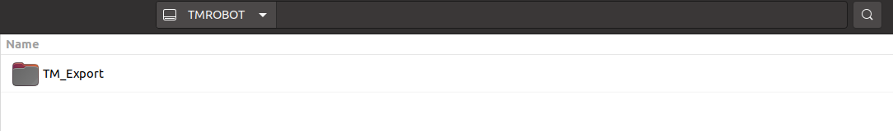

# __TM ROS Jazzy Driver vs TMflow software Usage__
> Step1: Place this downloaded component __TM_Export__ folder in the root directory of <u>a USB drive<u> labeled with __TMROBOT__. 
> Step2: Insert the <u>USB drive<u> into to <u>Control Box<u>, and navigate to &rArr;  System &rArr; Import/Export to import the component onto the robot. 

 
    

## __Import Data Table Setting__
  To use the Import function: Click on the Import button at the top left, select the robot of the data source in the flash drive from the robot list, and then select the desired data from the Select file box. Click an item in this box to add the item to the Selected Files box. After completing the new addition, click Import in the bottom-right corner to start the Import procedure. 
 <!-- For the __TMflow__ Series, it needs to be used with the __Data_Table_Setting_TM_ROS_Default__ file. --> 
 <!-- For the __TMflow 2__ Series, it needs to be used with the __Data_Table_Setting_TM2_ROS_Default__ file. -->
 -  For the __TMflow 2__ Series running on __TM ROS 2 Jazzy Driver__, it needs to be used with the __Data_Table_Setting_TM2_Jazzy_Default__ file. 
 -  For the __TMflow 2__ Series running on TM ROS Driver versions older than __ROS2 Humble__ (such as __ROS2 Foxy__ or __ROS1 Noetic__), it is mandatory to use the __Data_Table_Setting_TM2_ROS_Default__ configuration file. 

### &sect; Insert the USB flash drive into the Control Box
  Mouse-click to enter the page of __System &rArr; Import/Export__ in order.   
1. Click Import on the top left, then select to apply the imported setting ``TMROS_EthSlave`` in the Robot List prompted and click OK. 
2. Click to select the project ``Ethernet Slave`` to import in the Import Project List prompted. 
3. Click to select the specified file``Data_Table_Setting_TM2_Jazzy_Default`` of the setting listed in Selected Files.
4. Click Import at the bottom-right corner to import the setting. 

    

### &sect; Transmit the __Ethernet Slave Data Table__ TM ROS default settings
 After importing, mouse-click to enter the page of __Setting &rArr; Connection &rArr; Ethernet Slave__ in order.  

 1. On the ``Ethernet Slave`` setting page, let Data Table Setting STATUS: Disable, then click ``Data Table Setting`` to enter the next page. 
 2. On the ``Receive/Send Data Table Setting`` setting page, click ``Open`` to select files of the setting listed in the Transmit File List prompt. 
 3. Select the specified file ``Data_Table_Setting_TM2_Jazzy_Default`` in the Transmit File List prompted and click OK. 
 4. Return to the ``Ethernet Slave`` setting page, and enable the `Data Table Setting` item to STATUS: Enable. 

    

You have completed the predefined TM ROS default project to receive/send specific data. 

