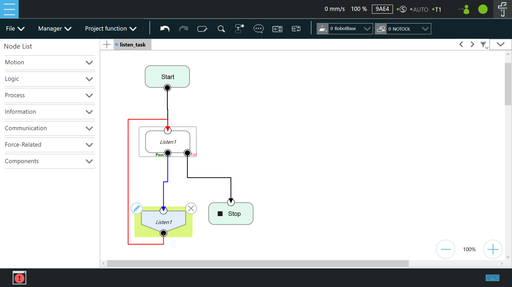
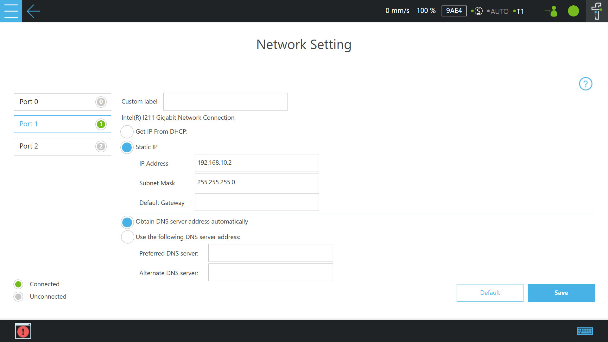
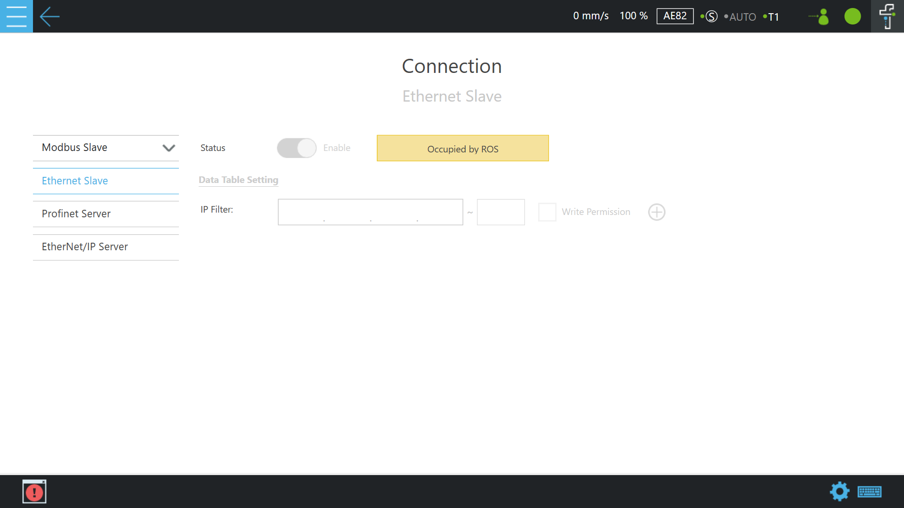
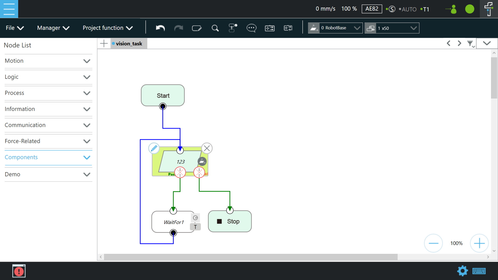
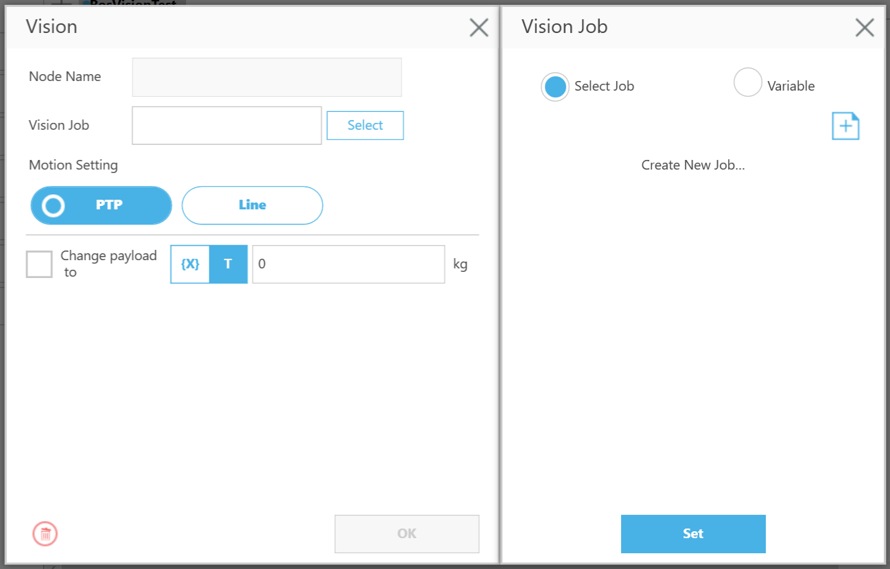
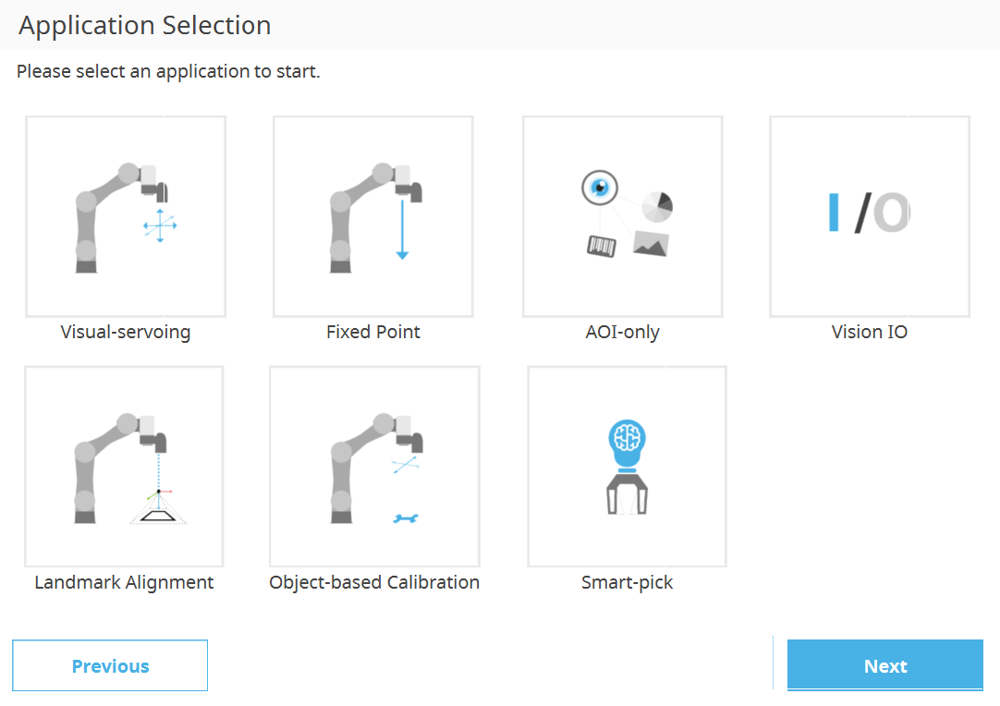
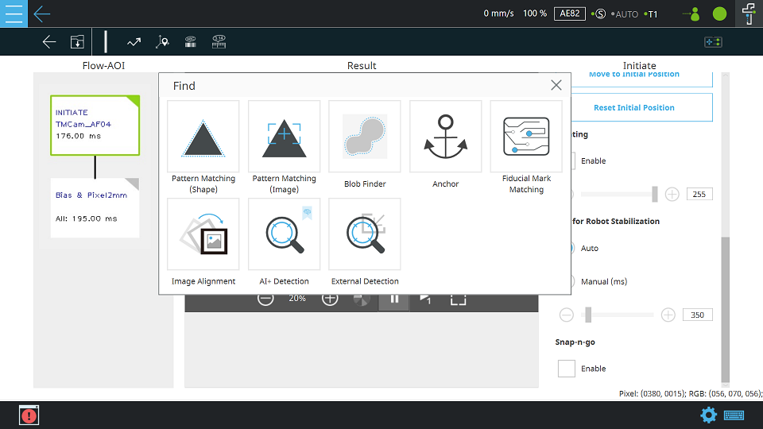
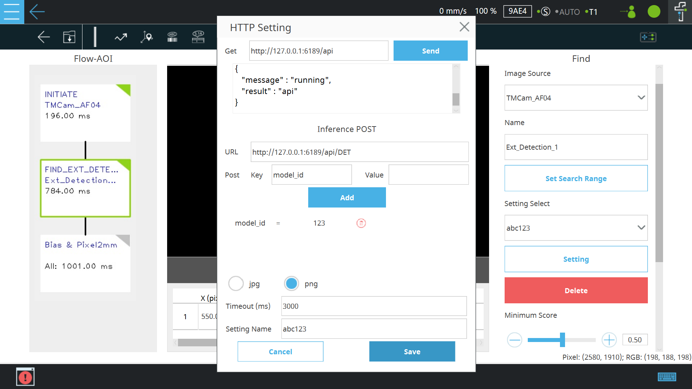
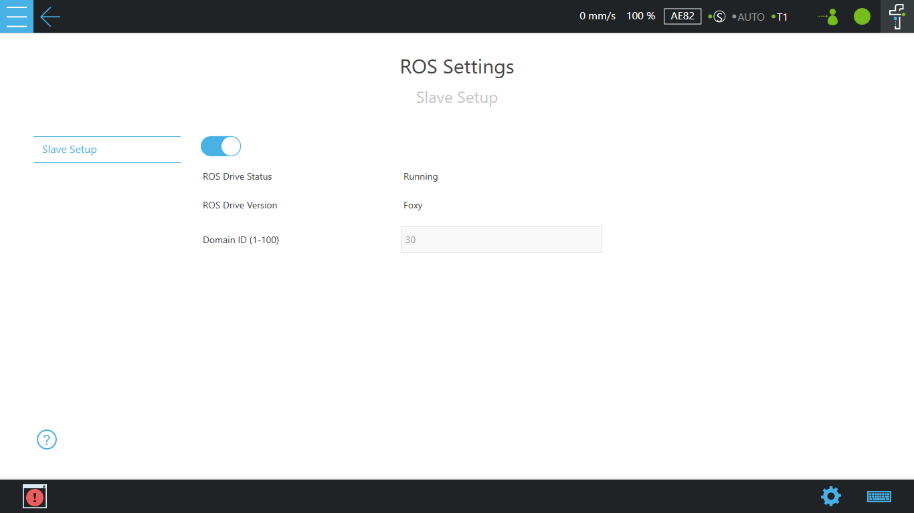

# __TM ROS Driver Usage and Installation__
The TM ROS Windows driver is designed to interface the TM Robot's operating software (__TMflow2__) with the Robot Operating System (ROS) so that program developers and researchers can build and reuse their own programs to control the TM robot externally.

## __1. Usage and Installation__
> * This manual is for <u>**ROS2 Foxy**</u> vs _TMflow2_ version.<br/>
> * TM ROS driver is embedded in the robot controller via _TMflow 2_ and is based on ROS2 Foxy.<br/>
>> :bulb: The operation interface of _TMflow2_: Navigate to __≡__ and click to expand the function menu, including the icons __Login/Logout__, __Connect__, __View__, __Run Setting__, __Project__, __Configuration__, and __System__. Please refer to _Software Manual TMflow_ ([SW2.14_Rev1.00](https://www.tm-robot.com/zh-hant/wpfd_file/software-manual-tmflow_sw2-14_rev1-00_en/)).<br/>
>> * The driver-embedded function related to the robot can be set in __Configuration__ &rArr; __ROS Settings__ of the _TMflow 2_.
>
> * Just clone the TM ROS App of the git repository into your working directory and then build it.<br/>
>
> &#10148;  After installing the correct ROS version of the computer, the next step is to ensure that your hardware, control computer, and TM Robot are all properly configured to communicate with each other. See below to make sure the network settings on your computer are correct, the TM Robot's operating software (_TMflow 2_) network settings are ready and the __Listen node__ is running.<br/>
<div> </div>

## __2. TMflow Listen node setup__
The __Listen node__: a socket server can be established and be connected with ROS by an external device to communicate according to the [defined protocol](https://assets.omron.eu/downloads/manual/en/v1/i848_tm_expression_editor_and_listen_node_reference_manual_en.pdf). The user can make the robot communicate with the user's ROS (remote) computer equipment through a wired network when all the network parameters in the _Network setting_ are set.<br/>
>
> 1. Create a _Listen task_ of flow project of __TMflow__ software, and then drag the __Listen node__ from the __Node List__ menu (&rArr; Communication &rArr; Listen) onto the project flow, as shown below.
>
<br/>

   
>
>
> 2. Set the `Network` settings: mouse-click to enter the page of __System &rArr; Network__ in order.  
> &#10148; Example: Set the Subnet mask: 255.255.255.0 and IP address 192.168.10.2  
>> **Note**: Set the network mask and the communication with the TM Robot must be in the set domain.  
>
<br/>

   
>
>
> 3. The __Ethernet Slave__ and `Data Table Setting` are no setup required. As the "__Configuration &rArr; ROS Setting__" is __Running__, the <u>build-in ROS Data Table Setting</u> will be automatically selected (as shown in the figure below, occupied by ROS). 
>
<br/>

   
>
>> The user can skip this step as follows: The following is only an introduction to the parameters of the ROS data table.
>
> The <u>build-in ROS Data Table Setting</u> <sup>1</sup> to receive/send specific data is listed below: 
>
>       - [x] Robot_Error
>       - [x] Project_Run
>       - [x] Project_Pause
>       - [x] ESTOP
>       - [x] Camera_Light
>       - [x] Error_Code
>       - [x] Joint_Angle
>       - [x] Coord_Robot_Flange
>       - [x] Coord_Robot_Tool
>       - [x] TCP_Force
>       - [x] TCP_Force3D
>       - [x] TCP_Speed
>       - [x] TCP_Speed3D
>       - [x] Joint_Speed
>       - [x] Joint_Torque
>       - [x] Project_Speed
>       - [x] Robot Light
>       - [x] Ctrl_DO0~DO7
>       - [x] Ctrl_DI0~DI7
>       - [x] Ctrl_AO0
>       - [x] Ctrl_AI0~AI1
>       - [x] END_DO0~DO2
>       - [x] END_DI0~DI2
>       - [x] END_AI0
>
>    <sup>1</sup> The <u>build-in ROS Data Table Setting</u> is no setup required.  
>
>    If you need to check more about the __maximum, minimum, and average calculation properties of joint torque__ <sup>2</sup> listed below, these _three checked items_ require <u>TMflow 2.16 or later</u> versions to support.
>
>       - [x] Joint_Torque_Average
>       - [x] Joint_Torque_Min
>       - [x] Joint_Torque_Max
>
>    <sup>2</sup> This function requires <u>TMflow 2.16 or later</u> versions to support.
>
> 4. Don't forget to press the Play/Pause Button on the Robot Stick to start running this _Listen task_ project.
>


###  &sect; __Remote connection to TM ROBOT__
> Static IP of remote connection network settings through the wired network.<br/> 
>
> 1. Set the wired network of the user's (remote) Ubuntu computer by mouse-click on the top right of the desktop &rArr; Click on "__Wired Settings__" &rArr; Click on the gear icon &rArr; In the IPv4 feature options, click on "Manual" in order.<br/> 
<br/>

   
> <br/>
> 2. Set the Static IP settings: where the IP address is fixed for the first three yards same as the previous setting 192.168.10, last yards 3-254 machine numbers are available. (Because _TM ROBOT_, you have been set to 192.168.10.2)<br/> 
> &#10148;  Example: Set the Netmask: 255.255.255.0 and IP address 192.168.10.30 <br/>
<br/>

   
> <br/>
> 3. Check Internet connection: start a terminal to test the connectivity with the target host _TM ROBOT_, by typing ping 192.168.10.2
>
<br/>

   
> <br/>
>> :bulb: **Tip**: Remember to reconfigure the network settings due to <u>static IP changes</u> or <u>replacement of the ROS control PC</u>.<br/>
>> As mentioned above, a valuable debugging tool is your operating system's <u>ping</u> command. If nothing appears to happen or an error is thrown, the robot cannot be accessed from your computer. Please go back to the top of this chapter and re-operate in the order of instructions.<br/>
>> If you are an experienced user, you may just need to <u>turn off</u> &rArr; <u>turn on</u> the gear icon of "__Wired Settings__" on your computer or to <u>turn off</u> &rArr; <u>turn on</u> the "__Ethernet Slave Data Table__" setting of the robot to reconfigure the hardware settings.<br/>
> 


###  &sect; Common usage of TM ROS Windows driver
> __ROS2 driver usage__ through the Listen Node<br/>
> :bulb: Do you prepare the __TM Robot__ ready ? Make sure that TM Robot's operating software (__TMflow__) network settings and __ROS Settings__ _(ROS Drive status: &rArr; __`Running`__)_ are ready and the __Listen node__ is running. Do you build TM relative ROS apps <sup>1</sup> on your (remote) computer?<br/>
> After the user has set up the ROS2 environment (example : [Debian packages for ROS 2 Foxy](https://docs.ros.org/en/foxy/Installation/Ubuntu-Install-Debians.html)) and built the TM relative ROS apps <sup>1</sup> based on the specific workspace, please enter your workspace `<workspace>` by launching the terminal, and remember to make the workspace visible to ROS.<br/> 
>
> ```bash
> source /opt/ros/foxy/setup.bash
> cd <workspace>
> export RMW_IMPLEMENTATION=rmw_fastrtps_cpp
> export ROS_DOMAIN_ID=<ROS_DOMAIN_ID>
> source ./install/setup.bash
> ```
>> **Note**: Domain ID is the key to ROS communication, and please make sure the ROS node works under the ROS environment setup with the same Domain ID as the robot.
>
&#10146; <sup>1</sup>  The user can download the [Embedded TM ROS basic App](https://www.tm-robot.com/en/download-center/#3100-4745-wpfd-embedded-tm-ros-driver
) packages from Techman Download Center for the basic TM ROS application or clone the [Experimental TM2 Foxy ROS Apps](https://github.com/TechmanRobotInc/tm2_ros2) of the GitHub repository for more advanced ROS applications.
<div> </div>

## __3. TMflow Vision node setup and prerequisites for using TM ROS Vision__
> The __Vision node__ provides the creation of a plane with fixed-point type, servo type, and object type as well as a variety of AOI identification functions.
> TM ROS Driver can receive the source image from the vision job (with External Detection) and publish it as a ROS topic.<br/>
> The following describes how the user can acquire image data through TMvision&trade; of TM Robot. **(Built-in Vision System)**

### &sect; __Prerequisites for using TM ROS Vision__
  
>
> __Dependencies__
>
> - ROS2 Foxy
> - Python packages:
>   1. flask
>   2. waitress
>   3. opencv-python==3.4.13.47 (Minimum)
>   4. numpy
>   5. datetime  
>
>    For example, install Python3 packages: 
>      *  pip3 install flask
>      *  pip3 install waitress
>      *  pip3 install opencv-python
>      *  pip3 install datetime
>
> __Techman Robot Vision__
>
> - type: sensor_msgs::msg::Image
> - message name: techman_image
>
> __Run TM ROS Vision driver__
>
> Make sure that __ROS Settings__ _(ROS Drive status: &rArr; __`Running`__)_ is ready. Please refer to the following section: "__4.ROS Settings on Configuration__".
>
> :bulb: The user can check whether the connection succeeds or not. When you proceed to the following steps introduced in the following text: step1 &rArr; step4 of § TMflow Vision node setup.


### &sect; __TMflow Vision node setup__

>
> 1. Create a _Vision task_ project of __TMflow__ software, drag the __Vision node__  from  the __Node List__ menu (&rArr; Process &rArr; Vision) onto the project flow and then click the "__+__" to add your Vision Job, as shown below.<br/>
<br/>

   
>
> 2. Select the __AOI-only__ and Click __Next__ while editing the vision job type. Set up the proper initial position and camera parameters.<br/>
<br/>

  
> Note: TMflow software version changes may have slightly different settings. ([SW2.14_Rev1.00](https://www.tm-robot.com/zh-hant/wpfd_file/software-manual-tmflow_sw2-14_rev1-00_en/))<br/>
>
> 3. Click __Find__ &rArr; __External Detection__, which adds an _External Detection_ node to the Vision Job flow.
<br/>

  
>
> 4. To set up _External Detection_, please enter `` http://127.0.0.1:6189/api `` in the __HTTP Setting__ blank text and click the __Send__ button. If normal, the text box will receive a message in JSON format as shown below. Then, enter `` http://127.0.0.1:6189/api/DET `` in the URL blank text and type arbitrary letters in the __Value__ blank text; the __Key__ will be generated automatically. Assign a name to the model in the __Model name__ blank text and click the __Save__ button.
>
<br/>

  
>
> 5. Don't forget to press the Play/Pause Button on the Robot Stick to start running this _Vision task_ project.
>
>    Note: For more about __External Detection__, please refer to Software Manual TMvision([SW2.14_Rev1.00](https://www.tm-robot.com/zh-hant/wpfd_file/software-manual-tmvision_sw2-14_rev1-00_en/)).<br/>


###  &sect; TMflow Vision node usage
> &#10148; Receive image data on the user's Linux computer from the TMflow Vision node.<br/>
> :bulb: Do you prepare the TM Robot ready? Make sure that TM Robot's operating software (TMflow) relative __HTTP Parameters__ Vision settings and __ROS Settings__ _(ROS Drive status: &rArr; __`Running`__)_ are ready and the __Vision task__ project is running. Do you build TM relative ROS apps <sup>1</sup> on your (remote) computer?<br/>
>
> Now, in a new terminal of your (remote) ROS2 Linux computer: Source setup.bash in the workspace path and run to get image data from TMvision&trade; by typing
>
> ```bash
> source /opt/ros/foxy/setup.bash
> cd <workspace>
> export RMW_IMPLEMENTATION=rmw_fastrtps_cpp
> export ROS_DOMAIN_ID=<ROS_DOMAIN_ID>
> source ./install/setup.bash
> ros2 run image_sub sub_img
> ```
>
>> **Note**: The <ROS_DOMAIN_ID> is the key to ROS communication and must be the same as the value of _TM Flow 2_ in the _ROS Settings_.<br/>
>
> Then, the viewer will display image data from _TMflow_.
<div> </div>

## __4. ROS Settings on Configuration__ 
> In the ROS Settings, the user can enter the domain ID and turn on the TM ROS driver using the toggle button.
> Navigate to __Configuration &rArr; ROS Setting__ and check the _ROS Drive Status_: When the _ROS Drive Status_ label prompts is _Running_, it means the TM ROS Driver is ready.<br/>
>> The TM ROS driver requires the TM Ethernet Slave to communicate with the robot information and publish it as a ROS topic; therefore, when the TM ROS Driver is running, the TM Ethernet Slave will be occupied and cannot be closed manually.
>> For the convenience of ROS users, once it is turned on, it will be automatically turned on by default. If the user confirms that they no longer want to use the "embedded TM ROS Driver" function, the user must manually turn it off again to allow the system memory to return to the default off. 
>
> &#10148; Run the embedded ROS driver
> Mouse-click to enable the `Slave Setup` setting and wait for the status: &rArr; __`Running`__. 
<br/>

  
> &#10148; Stop running the embedded ROS driver
> Mouse-click the toggle button again and the status will show `NotRun`.
<div> </div>

