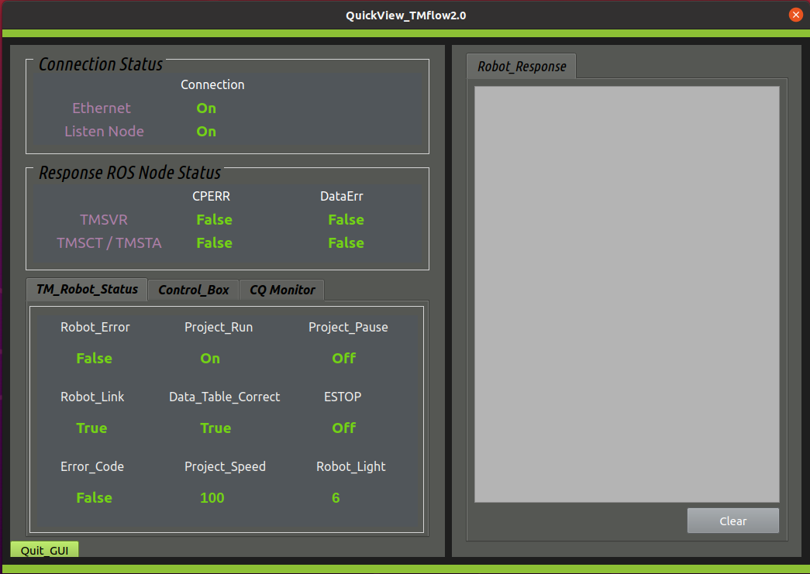

# __TM External GUI debugging and Demonstration__
This chapter describes a simplified GUI for displaying tm_driver connection status, sct, sta, svr messages, and robot status. The user can optionally install the _ui_for_debug_and_demo_ package to aid in viewing messages between the driver and the robot through the GUI display.

## &sect; GUI Debugging description
> * If the user forgets to run the TM ROS driver, the user will see all the controlled label items of the GUI displayed as "NaN". 
> * The user can click the"``Quit_GUI``" button or click the "``x``" close button in the upper right corner to close this GUI. 
> * If "``Ethernet``" and "``Listen Node``" connection displays are "on", it means that ROS SvrClient and SctClient are successfully connected. 
> * If the"``Ethernet``" connection display is "off", the user should check whether the TM Robot has been started or whether the network settings are correct. 
> * If the"``Listen Node``" connection is "off", the user should check whether the task project is running. 
> :bulb: If "``Listen Node``" connection is interrupted as "``Project_Run``" is stopped, the "``Listen Node``" connection will be "off". 
> * If both "``Ethernet``" and "``Listen Node``" connection displays  are "on", but the "``Robot_Link``" is false or "``Robot_Error``" is true; this means the robot is working abnormally, or maybe the ESTOP button was pressed or some kind of protection or error 1 occurred. Therefore, when the user sends a move script command at this time, it will not work.  
> 1 For more detailed information, please refer to the TM Robot User Guide.  
> * The user can use the self-developed script to read/write project data through communication protocols to control the TM Robot. If it does not work properly, the user can quickly determine whether there is a communication error code by viewing the "``Response ROS Node Status``" display. 
> * When the user sends a command or clicks DO0 Ctrl "``H/L``" button of Control_Box, the user also can see the response message 2 embedded in the "``Robot Response``" item view. 
> 2 For details of this item, please refer to __SctResponse.msg__, __StaResponse.msg__ and __SvrResponse.msg__ of TM ROS driver code. 
> * The user can click "``clear``" button to clear the old response message. 
> :bulb: If the"``Ethernet``" connection is interrupted, the display of most controlled label items in the GUI will be displayed as "NaN" and the robot feedback state will remain the last state and become invalid. 

## &sect; Prerequisites
> 1. To use this package, make sure your ROS PC is installed correctly.
> 2. The user has successfully configured the network settings of the TM Robot and the user's PC in the same subnet. In other words, users have been able to ping the remote system on the same subnet successfully.
>>:bulb: Tip:  For example, set the user computer IP address and remote TM Robot to 192.168.10.30 and 192.168.10.2 (Netmask: 255.255.255.0). Users can ping the remote IP address 192.168.10.2, by typing "ping 192.168.10.2". 
>
 

   
 
> 3. The user already knows how to use _TMflow 2_ programming, especially to configure TM ROS _Ethernet Slave_ "Data Table Setting" and the Listen nodes programming through a flow project. In other words, the user has created and completed the Listen task with the TM ROS setting of a TMflow software process project.
>>:bulb: Tip: The user can refer to the chapter introduced in the main text: _3. TM ROS driver usage and installation_ for quick and easy setup or refer to the _Software Manual TMflow_ for details.
>
> 4. Remember to press the Play/Pause (&#9658;) button on the Robot Stick to start running this Listen task project under auto Mode.
>>:bulb: Tip: If under Manual Mode, it requires the trigger of the _Enabling Switch_ function. Therefore, the user needs to press and hold the __Enabling Switch__ button slightly and continuously to press the Play/Pause (&#9658;) button to run the operation. The user can select to suspend _Enabling Switch_ on the UI of _TMflow_ &rArr;  Configuration &rArr; Safety, and the triggering effect of _Enabling Switch_ will be disabled. For details of the _Enabling Switch_ function, refer to the relevant contents in the _Safety Manual_ or the _Software Manual TMflow_.
>
 

   
 

## &sect; Usage with GUI debugging on the external Linux PC
> Note: If the user has even successfully built a specific code(tm2_ros2), the user only needs to change to the TM driver workspace path  ``cd ~/tm2_ws``, and then directly refer to steps 5~6 below. 
> 1. Type to create a root workspace directory by starting a terminal: For example,  ``tm2_ws`` or ``catkin_ws``, then type to change the current directory into the workspace directory path. 
``mkdir ~/tm2_ws`` 
``cd ~/tm2_ws`` 
> 2. Clone the TM driver of the git repository into the current directory by typing 
``git clone https://github.com/TechmanRobotInc/tm2_ros2.git`` 
> 3. After the download done, rename the download folder ``tm2_ros2``(or ``tm2_ros2-master``) to ``src`` by typing 
``mv tm2_ros2 src``   (or right-click on the download folder, select "Rename...") 
> 4. At the workspace directory to build the download packages and source 'setup.bash' in this workspace to make the workspace visible to ROS. 
**Note**: Do you set ``source /opt/ros/foxy/setup.bash`` ready? Make sure to obtain the correct setup file according to your workspace hierarchy, and then type the following below to compile. 
``colcon build`` 
``source ./install/setup.bash`` 
> 5. In a new terminal: Source setup.bash in the workspace path and run the driver to connect to TM Robot by typing 
``source ./install/setup.bash`` 
``ros2 run tm_driver tm_driver robot_ip:=<robot_ip_address>`` 
The <robot_ip_address> is the IP address of the TM Robot, the user can get it through TM Flow, for example, 192.168.10.2 
> 6. In another new terminal: Source setup.bash in the workspace path and start GUI debug by typing 
``source ./install/setup.bash`` 
``ros2 run ui_for_debug_and_demo robot_ui`` 
>
>
 

   
>>:bulb: Tip: If the TM ROS Driver is unavailable in the network, all labels will be displayed as "NaN".
>

 

