# __TM ROS Driver Usage and Installation__
The TM ROS driver is designed to interface the TM Robot's operating software (__TMflow2__) with the Robot Operating System (ROS) so that program developers and researchers can build and reuse their own programs to control the TM robot externally.

---
## __1. Usage and Installation__
> * This manual is for <u>**ROS2 Jazzy**</u> vs _TMflow2_ version.<br/>
>> :bulb: The operation interface of _TMflow2_: Navigate to __≡__ and click to expand the function menu, including the icons __Login/Logout__, __Connect__, __View__, __Run Setting__, __Project__, __Configuration__, and __System__. Please refer to _Software Manual TMflow_ ([SW2.14_Rev1.00](https://www.tm-robot.com/zh-hant/support/download-center/)).<br/>
>
> * Just clone the TM ROS driver from the git repository into your working directory and then build it.<br/>
> * The user can directly return to "__[4. TM Program Script Demonstration](./tm_jazzy_demo.md)__" introduced above: then refer to steps 1 to 4 of this chapter __&sect; Use the demo code and drivers on an external Linux PC__.<br/>
>
> &#10148;  After installing the correct ROS version on the computer, the next step is to ensure that your hardware, control computer, and TM Robot are all properly configured to communicate with each other. See below to make sure the network settings on your computer are correct, the TM Robot's operating software (_TMflow 2_) network settings are ready, and the __Listen node__ is running.<br/>
<div> </div>

---
## __2. TMflow Listen node setup__
The __Listen node__: a socket server can be established and be connected with ROS by an external device to communicate according to the [defined protocol](https://assets.omron.eu/downloads/manual/en/v1/i689_tm_collaborative_robot_software_manual_tmflow_version_2_operation_manual_en.pdf). The user can make the robot communicate with the user's ROS (remote) computer equipment through a wired network when all the network parameters in the _Network setting_ are set.<br/>
>
> 1. Create a _Listen task_ of flow project of __TMflow__ software, and then drag the __Listen node__ from the __Node List__ menu (&rArr; Communication &rArr; Listen) onto the project flow, as shown below.
>
<br/>

   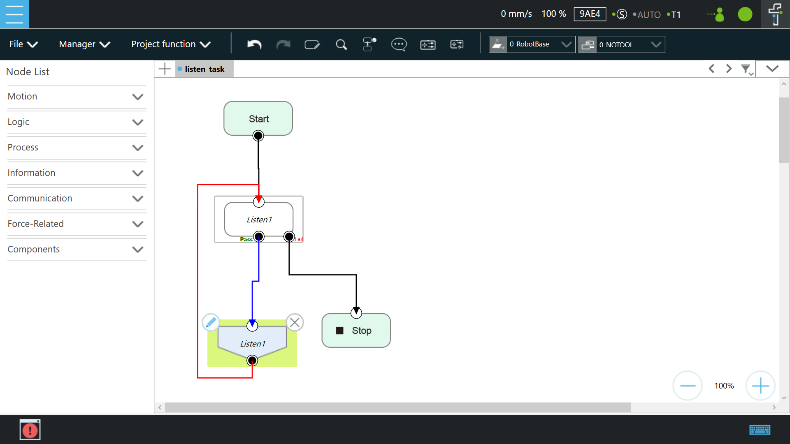

> 2. Set the __Network Setting__: mouse-click to enter the page of __System &rArr; Network__ in order.
> &#10148; Example: Set the Subnet mask: 255.255.255.0 and IP address 192.168.10.2 <br/>
>> **Note**: Set the network mask, and the communication with the TM Robot must be in the set domain.<br/>
> 
<br/>

   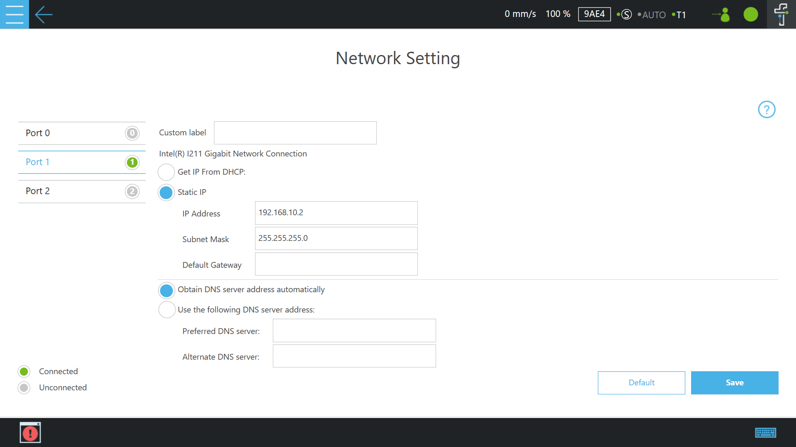

> 3. Set the __Ethernet Slave__ `Data Table Setting`:<br/>

> [!NOTE]
> Previously, TM ROS required manual setup of Ethernet Slave entries. Users had to [manually select every predefined parameter](https://github.com/TechmanRobotInc/tm2_ros2/tree/jazzy/doc/tm_jazzy_ethernet_slave_data_set.md) to ensure the Data Table was correctly configured without omissions. The method has been changed to directly __import a software package__<sup>1</sup> containing the specified configuration file "Data_Table_Setting_TM2_Jazzy_Default" to configure the Ethernet Slave Data Table.<br/> 
> :rocket: <sup>1</sup> See [TM ROS Jazzy Driver vs TMflow Software Usage: Import Data Table Setting](https://github.com/TechmanRobotInc/tm2_ros2/tree/jazzy/configs/README.md).<br/>
>> **Note**: Set the `Commounicate Mode`: __BINARY__<br/>
>
<br/>

   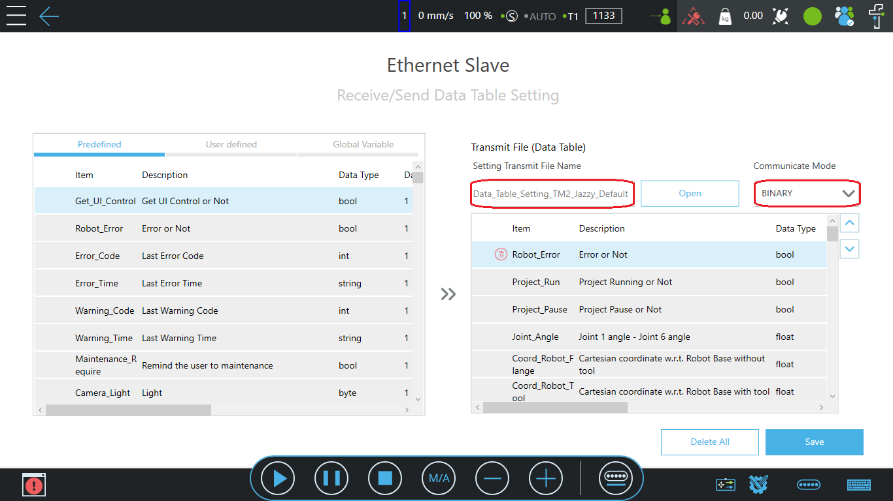

> 4. Set the __Communication__ `Ethernet Slave setting`: mouse-click to enable or disable TM Ethernet Slave. Once enabled, the robot establishes a Socket server to send the robot status and data to the connected clients and permissions to access specific robot data.<br/>
> Mouse-click to enable the `Ethernet Slave` setting and let `STATUS:` &rArr; __`Enable`__. 
>
<br/>

   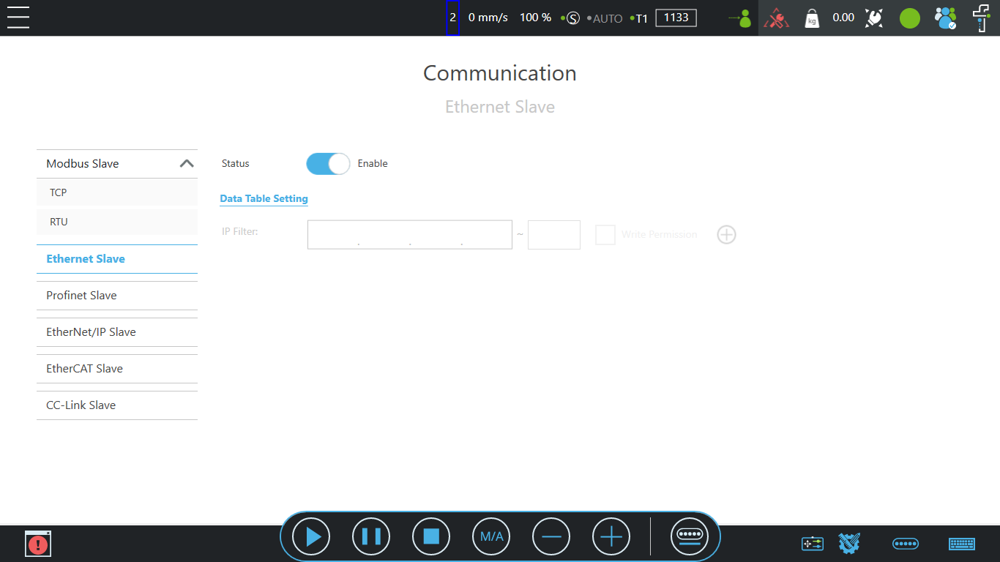

> 5. Don't forget to press the Play/Pause Button on the Robot Stick to start running this _Listen task_ project.
>


###  &sect; __Remote connection to TM ROBOT__
> Static IP of the remote connection network settings through the wired network.<br/>
>
> 1. Set the wired network of the user's (remote) Ubuntu computer by mouse-click on the top right of the desktop &rArr; Click on "__Wired Settings__" &rArr; Click on the gear icon &rArr; In the IPv4 feature options, click on "Manual" in order.<br/> 
<br/>

   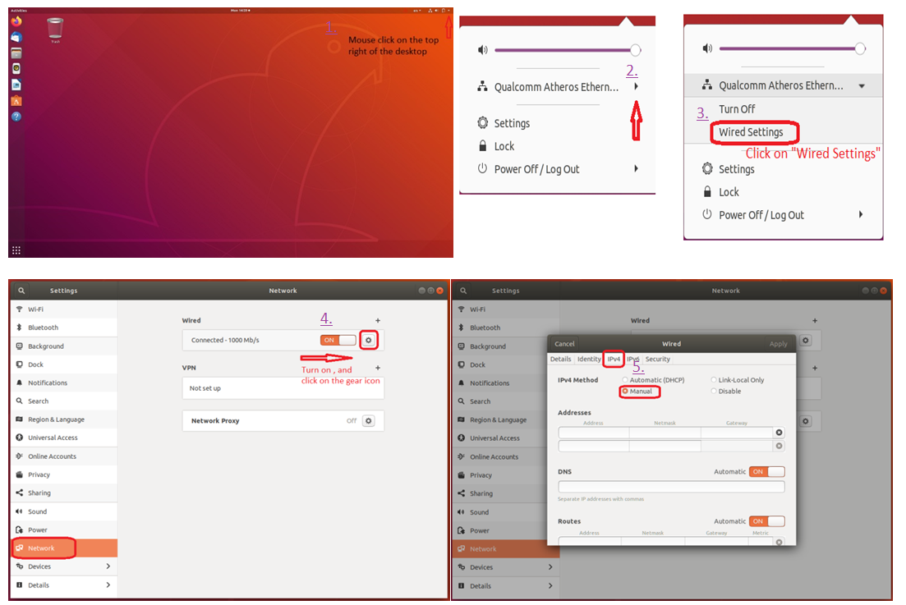

> 2. Set the Static IP settings: where the IP address is fixed for the first three yards same as the previous setting 192.168.10, last yards 3-254 machine numbers are available. (Because _TM ROBOT_, you have been set to 192.168.10.2)<br/> 
> &#10148;  Example: Set the Netmask: 255.255.255.0 and IP address 192.168.10.30 <br/>
<br/>

   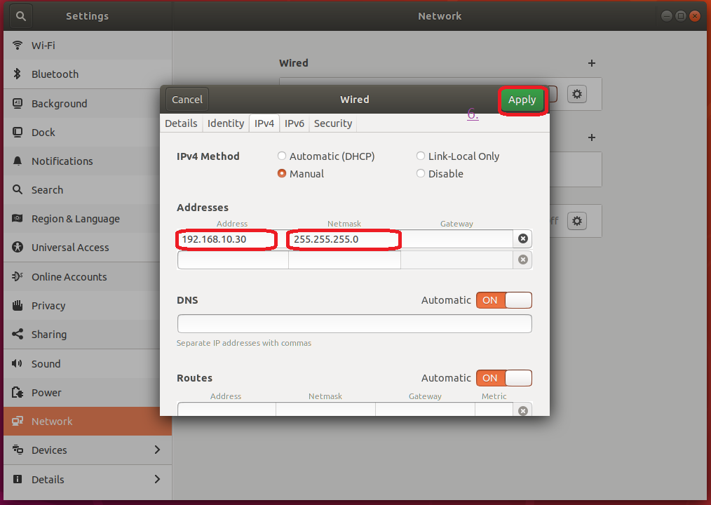

> 3. Check Internet connection: start a terminal to test the connectivity with the target host _TM ROBOT_, by typing ping 192.168.10.2
>
<br/>

   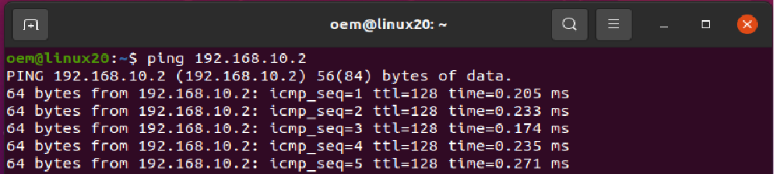

>> :bulb: **Tip**: Remember to reconfigure the network settings due to <u>static IP changes</u> or <u>replacement of the ROS control PC</u>.<br/>
>> As mentioned above, a valuable debugging tool is your operating system's <u>ping</u> command. If nothing appears to happen or an error is thrown, the robot cannot be accessed from your computer. Please go back to the top of this chapter and re-operate in the order of instructions.<br/>
>> If you are an experienced user, you may just need to <u>turn off</u> &rArr; <u>turn on</u> the gear icon of "__Wired Settings__" on your computer or to <u>turn off</u> &rArr; <u>turn on</u> the "__Ethernet Slave Data Table__" setting of the robot to reconfigure the hardware settings.<br/>
>


###  &sect; Common usage of TM ROS driver 
> __ROS2 driver usage__ through the Listen Node<br/>
> :bulb: Do you prepare the __TM Robot__ ready ? Make sure that TM Robot's operating software (__TMflow__) network settings are ready and the __Listen node__ is running. Do you build TM relative ROS apps <sup>1</sup> on your (remote) computer?<br/>
> After the user has set up the ROS2 environment (example : [Debian packages for ROS 2 Jazzy](https://docs.ros.org/en/jazzy/Installation/Ubuntu-Install-Debians.html)) and built the TM driver relative ROS apps <sup>1</sup> based on the specific workspace, please enter your workspace `<workspace>` by launching the terminal, and remember to make the workspace visible to ROS.<br/>
>
> ```bash
> source /opt/ros/jazzy/setup.bash
> cd <workspace>
> source ./install/setup.bash
> ```
> Then, run the driver to test whether the complete communication interface is working properly with the TM Robot by typing
>
>```bash
> ros2 run tm_driver tm_driver robot_ip:=<robot_ip_address>
>```
> Example :``ros2 run tm_driver tm_driver robot_ip:=192.168.10.2``, if the <robot_ip_address> is 192.168.10.2
>
> Now, the user can use a new terminal to run each ROS node or command, but don't forget to source the correct setup shell files as starting a new terminal.
>
> &#10146; <sup>1</sup>  The user can download the TM driver relative ROS apps [Experimental TM2 Jazzy ROS Apps](https://github.com/TechmanRobotInc/tm2_ros2/tree/jazzy) of the GitHub repository for ROS applications.<br/>
> **Note**: When you have finished, press CTRL + C in all terminal windows to shut everything down.<br/>
<div> </div>

---
## __3. TMflow Vision node setup and prerequisites for using TM ROS Vision__

> [!NOTE]
>> :rocket: We provide a new integration solution of [TM ROS and TM Eye-in-Hand (EIH) Camera API](https://github.com/TechmanRobotInc/tm_eih_cam_client?tab=readme-ov-file), allowing developers to directly access TM EIH Camera resources via the API: For example, by enabling the **TM EIH Camera API Server**, we simplify the cumbersome setup process for users.<br/>
>> For more details about the **TM EIH camera API** _(TMflow ≥ 2.20)_, you can refer to the document:[EIH Camera API Function Manual](https://www.tm-robot.com/zh-hant/support/download-center/)<br/>
>> If the user use the **TM EIH camera API** to control the robot, the user can skip the rest of this chapter.<br/>
>
> The following describes how the user can acquire image data using TM Robot's TMvision&trade; legacy method. **(Built-in Vision System)**
> The __Vision node__ provides the creation of a plane with fixed-point type, servo type, and object type, as well as a variety of AOI identification functions.
> TM ROS Driver can receive the source image from the vision job (with External Detection) and publish it as a ROS topic.<br/>

### &sect; __Prerequisites for using TM ROS Vision__

>
> __Dependencies__
>
> - ROS2 Jazzy
>
> - Python packages:
>   1. flask==3.0.2
>   2. waitress==2.1.2
>   3. opencv-python==4.8.0.74
>   4. numpy==1.26.4
>   5. datetime
>
>
> &#10148; _In Ubuntu 24.04, to use a Python virtual environment for development to prevent conflicts with system-level Python packages._
>>
>>
>> First, Install the necessary system libraries for running OpenCV, and a virtual environment.
>> ```bash
>> sudo apt install python3-pip python3-venv libgl1 libglib2.0-0 -y
>> ```
>> Then, create a virtual environment named <venv_ws> as your project directory and activate the virtual environment: 
>> ```bash
>> python3 -m venv <venv_ws>
>> source <venv_ws>/bin/activate
>> ```
>> The `<venv_ws>` means your specific workspace in the virtual environment, for example `tm2_venv`.<br/>
>>
>>
> &#10148; _Install Python dependency packages in a virtual environment_, for example `tm2_venv`.<br/>
>>
>>
>> It is recommended to execute the following commands to install these dependency packages in a virtual environment to ensure environment isolation.<br/>
>> ```bash
>> python3 -m venv tm2_venv
>> source tm2_venv/bin/activate
>> pip install opencv-python==4.8.0.74
>> pip install "numpy<2"
>> pip install waitress
>> pip3 install flask
>> pip3 install datetime
>> ```
>
> :bulb: __Usage of integrating ROS2 Jazzy with a pre-configured Python virtual environment to build the Vision project:__
> 1. Start a terminal, and navigate to your <workspace>, for example, `tm2_ws`<br/>
``cd ~/tm2_ws``<br/>
> 2.Set up the virtual environment `<venv_ws>`, for example `tm2_venv`, and allow it to use Python libraries already installed on the system.<br/>
``python3 -m venv --system-site-packages tm2_venv``<br/>
> **Note**: The --system-site-packages flag is critical for the virtual environment to access system-level ROS2 packages like rclpy.<br/>
> 3. Activate the virtual environment<br/>
``source tm2_venv/bin/activate``<br/>
> 4. Load the system-level ROS2 Jazzy environment variables<br/>
``source /opt/ros/jazzy/setup.bash``<br/>
> 5. Set RMW intermediate layer. (This step can be omitted if using the ROS default setting; here we assume you want to use cyclonedds instead).<br/>
``export RMW_IMPLEMENTATION=rmw_cyclonedds_cpp``<br/>
> 6. Build the project<br/>
``colcon build --cmake-args -DCMAKE_BUILD_TYPE=Release``<br/>
> 7. Load the current workspace build results<br/>
``source ./install/setup.bash``<br/>
> :bookmark_tabs: Note1: If you have built the TM ROS Apps before or downloaded new packages to expand new applications, it is recommended that you delete the build, install, and log folders by the command `rm -rf build install log`, and __recompile the workspace__.<br/>
> :bookmark_tabs: Note2: To exit the currently running Python virtual environment, use the command ``deactivate``. After execution, you'll see the text before the terminal prompt characters (e.g., `(tm2_venv)`) disappear, indicating you've returned to the system's default Python environment.<br/>
> :bookmark_tabs: Note3: If you want to re-enter the virtual environment later, simply execute: `source tm2_venv/bin/activate`.<br/>
>
>
> __Techman Robot Vision__
>
> - type: sensor_msgs::msg::Image
> - message name: techman_image
>
> __Build TM ROS Vision driver node on your (remote) computer__
>
> Under the environment settings, have been finished with your `<workspace>`, then type
>
> ```bash
> source tm2_venv/bin/activate
> cd ~/<workspace> && source ./install/setup.bash
> ros2 run tm_image image_talker
> ```
>
> :bulb: The user can check whether the connection succeeds or not. When you proceed to the following steps introduced in the following text: steps 6 of § TMflow Vision node setup.


### &sect; __TMflow Vision node setup__

> :bulb: Before going through the following steps, please build the TM ROS Vision driver node on your (remote) computer and then connect this (remote) computer to the local TM Robot computer.
>
> 1. Create a _Vision task_ project of __TMflow__ software, drag the __Vision node__  from  the __Node List__ menu (&rArr; Process &rArr; Vision ) (or _**AI Vision** of TMflow2.24_) onto the project flow, and then click the "__+__" to add your Vision Job, as shown below.<br/>
<br/>

  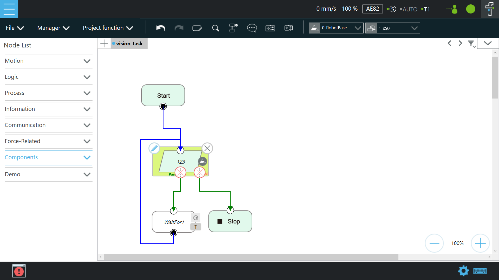 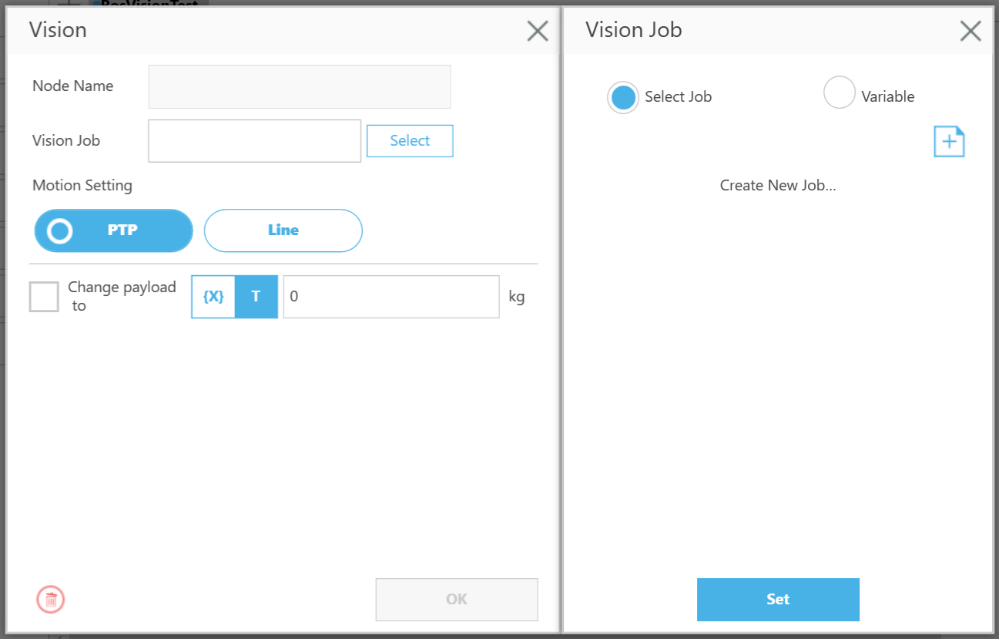

> 2. Select the __AOI-only__ (or _AOI of TMflow2.24_) and Click __Next__ while editing the vision job type. Set up the proper initial position and camera parameters.<br/>
<br/>

  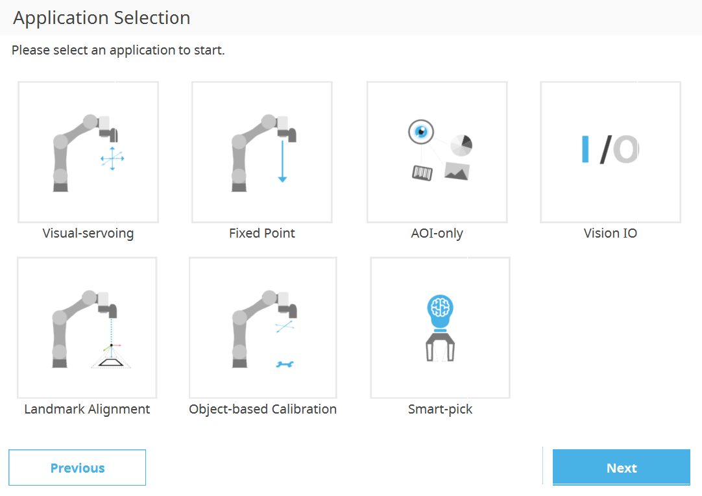

> Note: TMflow software version changes may have slightly different settings.<br/>
>
> 3. Click __Find__ &rArr; __External Detection__ (or _Click **+** &rArr; Click **Find** &rArr; Click **<u>Additional</u>** &rArr; Click **External Object Detection** of TMflow2.24_), which adds an _External Detection_ node to the Vision Job flow.
<br/>

  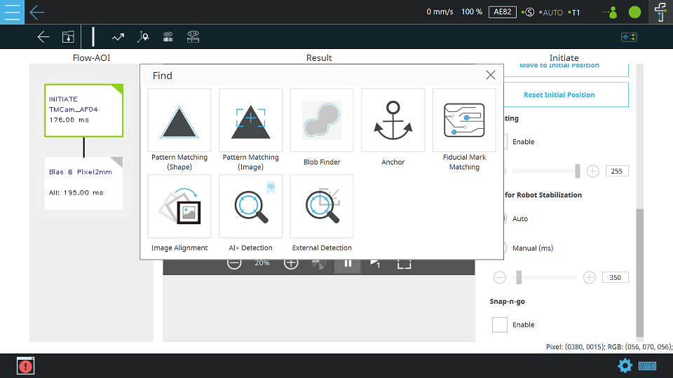

> 4. To check whether the connection succeeds or not, please enter ``<user_pc_ip_address>:6189/api`` in the __HTTP Setting__ blank text and click the __Send__ button to get the information of the (remote) computer for ROS.<br/>
> The `<user_pc_ip_address>` means the IP address of the user's (remote) ROS computer, for example, 192.168.10.12<br/>
> If normal, the text box will receive a message in JSON format as shown below.<br/>
<br/>

  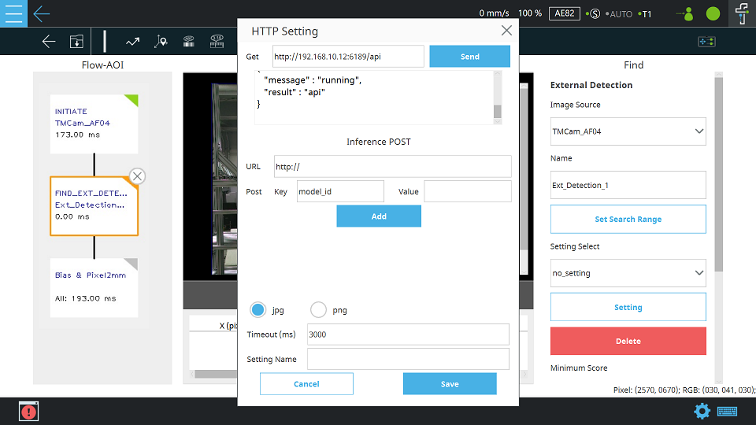

>    If the connection fails, a __TIMEOUT__ error will be displayed in the window. If the IP address of the user's (remote) ROS computer doesn't exist, **ERROR_CODE_7** will be displayed in the window.
<br/>

  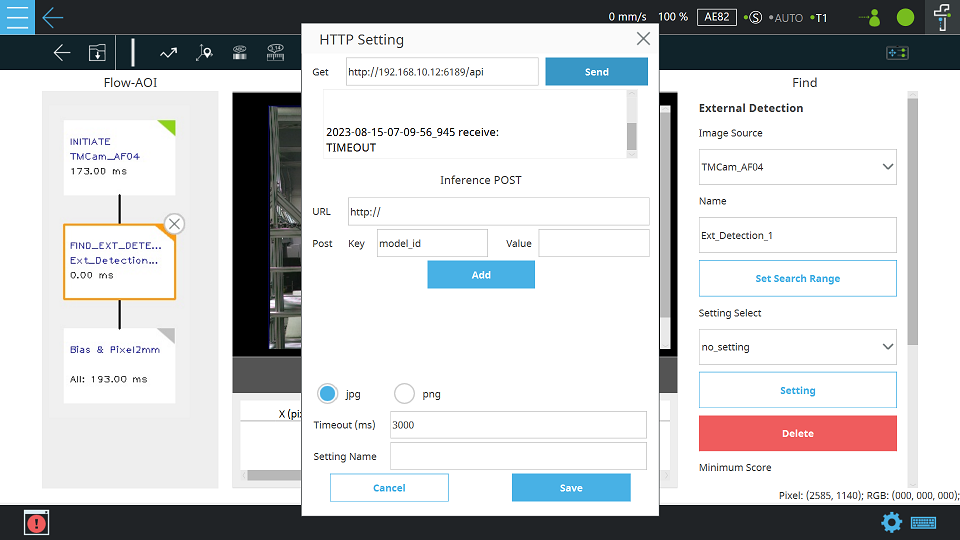 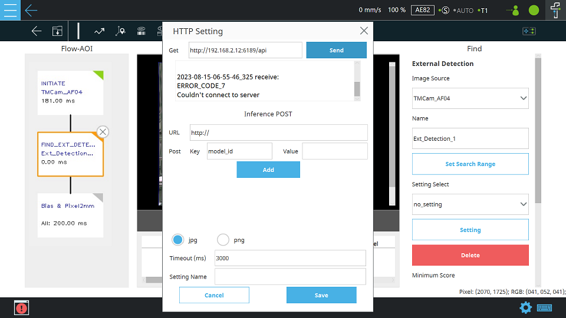

> 5. Enter ``<user_pc_ip_address>:6189/api/DET`` in the URL blank text and type arbitrary letters in the __Value__ blank text; the __Key__ will be generated automatically. Assign a name to the model in the __Model name__ blank text and click the __Save__ button.
<br/>

  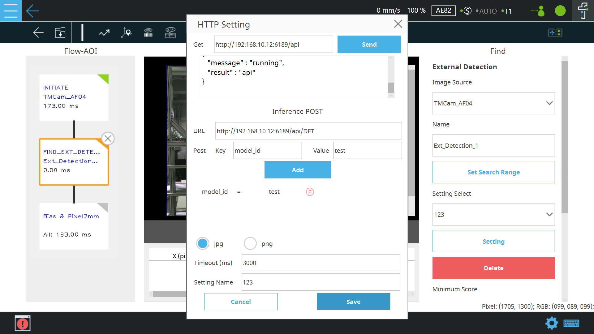

> 6. Don't forget to press the Play/Pause Button on the Robot Stick to start running this _Vision task_ project.
>
>    Note: For more about __External Detection__, please refer to Software Manual TMvision([SW2.14_Rev1.00](https://www.tm-robot.com/zh-hant/support/download-center/)).<br/>


###  &sect; TMflow Vision node usage
> &#10148; Receive image data on the user's Linux computer from the TMflow Vision node.<br/>
> :bulb: Do you prepare the TM Robot ready? Make sure that TM Robot's operating software (TMflow) relative __HTTP Parameters__ Vision settings are ready and the __Vision task__ project is running.<br/>
>
> Now, in a new terminal of your (remote) ROS2 Linux computer: Source setup.bash in the workspace path and run to get image data from TMvision&trade; by typing
>
> ```bash
> source /opt/ros/jazzy/setup.bash
> source tm2_venv/bin/activate
> cd <workspace>
> source ./install/setup.bash
> ros2 run image_sub sub_img
> ```
>
> Then, the viewer will display image data from _TMflow_.<br/>
> **Note**: When you have finished, press CTRL + C in all terminal windows to shut everything down.<br/>
<div> </div>

