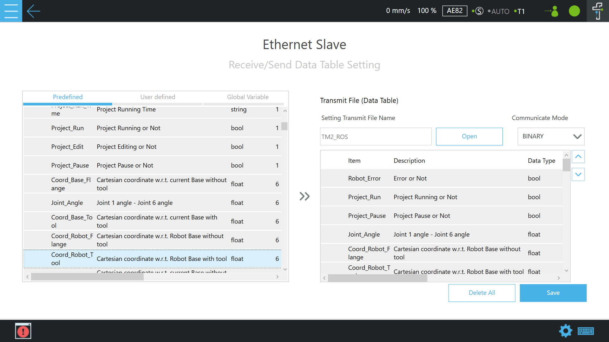

# TMflow Listen node setup - (Ethernet Slave) Data Table Setting
## A traditional method as follows:

> Set the __Ethernet Slave__ `Data Table Setting`: 
> Mouse-click to enter the page of __Setting &rArr; Connection &rArr; Ethernet Slave__ in order. 
>
> A previous traditional method as follows:  (Note: TMflow software version changes may have slightly different settings.)
The user can manually click the `Data Table Setting` 2 item and check the following boxes as item _predefined_ 3 to receive/send specific data:
>
>       - [x] Robot_Error
>       - [x] Project_Run
>       - [x] Project_Pause
>       - [x] Joint_Angle
>       - [x] Coord_Robot_Flange
>       - [x] Coord_Robot_Tool
>       - [x] TCP_Force
>       - [x] TCP_Force3D
>       - [x] TCP_Speed
>       - [x] TCP_Speed3D
>       - [x] Joint_Speed
>       - [x] Joint_Torque
>       - [x] Robot Light
>       - [x] ESTOP
>       - [x] Camera_Light
>       - [x] Error_Code
>       - [x] Ctrl_DO0~DO15
>       - [x] Ctrl_DI0~DI15
>       - [x] Ctrl_AO0
>       - [x] Ctrl_AI0~AI1
>       - [x] END_DO0~DO2
>       - [x] END_DI0~DI2
>       - [x] END_AI0
>       - [x] Project_Speed
>
>    2 <u>Turn off</u> Ethernet Slave. Let "STATUS: __Disable__" displayed on the Ethernet Slave setting page, then click `Data Table Setting` to enter the next page for related settings.
>
 

   

>    3 The checked items listed above must <u>all</u> be selected for TM2 ROS setting.
>> **Note**: Set the `Commounicate Mode`: __BINARY__ 
>
>    When you need to check more about the __maximum, minimum, and average calculation properties of joint torque__ 4 listed below, these _three checked items_ can be checked individually or all of them. Please leave them unchecked when not in use.
>
>       - [x] Joint_Torque_Average
>       - [x] Joint_Torque_Min
>       - [x] Joint_Torque_Max
>
>    4 This function requires <u>TMflow 2.16 or later</u> versions to support.
>
> 4. Set the __Communication__ `Ethernet Slave setting`: mouse-click to enable or disable TM Ethernet Slave. Once enabled, the robot establishes a Socket server to send the robot status and data to the connected clients and permissions to access specific robot data. 
> Mouse-click to enable the `Ethernet Slave` setting and let `STATUS:` &rArr; __`Enable`__. 
>
 

   

>
> 5. Don't forget to press the Play/Pause Button on the Robot Stick to start running this _Listen task_ project.
>

